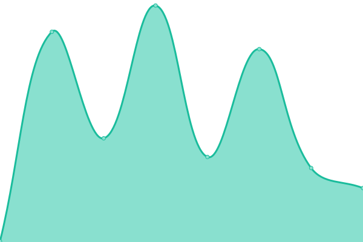
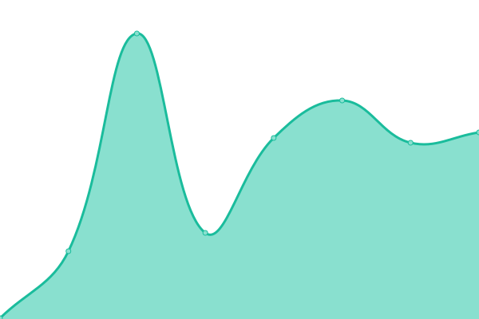
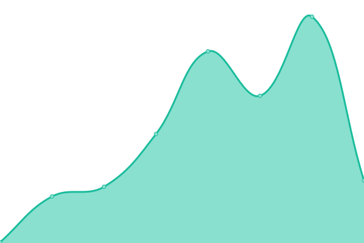
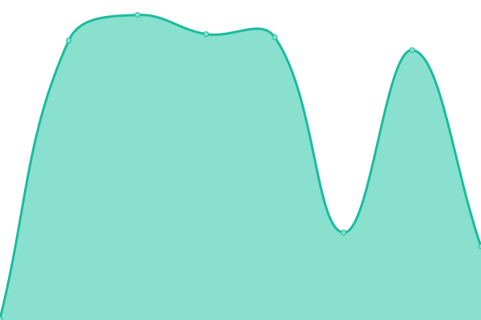
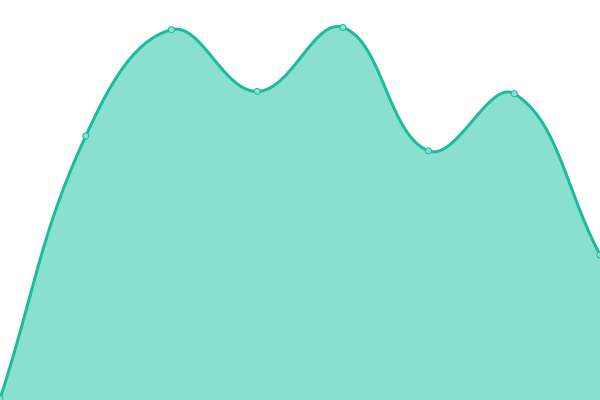
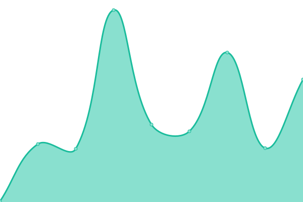

# [📈 Live Status](https://status.widemesh.com): <!--live status--> **🟥 Complete outage**

This repository contains the open-source uptime monitor and status page for [Widemesh](https://widemesh.com), powered by [Upptime](https://github.com/upptime/upptime).

With [Upptime](https://upptime.js.org), you can get your own unlimited and free uptime monitor and status page, powered entirely by a GitHub repository. We use [Issues](https://github.com/widemeshio/status-page/issues) as incident reports, [Actions](https://github.com/widemeshio/status-page/actions) as uptime monitors, and [Pages](https://status.widemesh.com) for the status page.

<!--start: status pages-->
<!-- This summary is generated by Upptime (https://github.com/upptime/upptime) -->
<!-- Do not edit this manually, your changes will be overwritten -->
<!-- prettier-ignore -->
| URL | Status | History | Response Time | Uptime |
| --- | ------ | ------- | ------------- | ------ |
|  [Vault](https://vaulty.widemesh.com/v1/sys/health) | 🟥 Down | [vault.yml](https://github.com/widemeshio/status-page/commits/HEAD/history/vault.yml) | 

 0ms
     
 | 

<a href="https://status.widemesh.com/history/vault">0.00%</a>
    

|  [Widemesh Registry Auth](https://id-registry.widemesh.com) | 🟥 Down | [widemesh-registry-auth.yml](https://github.com/widemeshio/status-page/commits/HEAD/history/widemesh-registry-auth.yml) | 

 0ms
     
 | 

<a href="https://status.widemesh.com/history/widemesh-registry-auth">0.00%</a>
    

|  [Widemesh Registry Service](https://registry.widemesh.com) | 🟥 Down | [widemesh-registry-service.yml](https://github.com/widemeshio/status-page/commits/HEAD/history/widemesh-registry-service.yml) | 

 0ms
     
 | 

<a href="https://status.widemesh.com/history/widemesh-registry-service">0.00%</a>
    

|  [Widemesh Logs](https://logs.widemesh.com) | 🟥 Down | [widemesh-logs.yml](https://github.com/widemeshio/status-page/commits/HEAD/history/widemesh-logs.yml) | 

 0ms
     
 | 

<a href="https://status.widemesh.com/history/widemesh-logs">0.00%</a>
    

|  [Widemesh KV](https://challenger.widemesh.com) | 🟥 Down | [widemesh-kv.yml](https://github.com/widemeshio/status-page/commits/HEAD/history/widemesh-kv.yml) | 

 0ms
     
 | 

<a href="https://status.widemesh.com/history/widemesh-kv">0.00%</a>
    

|  [Widemesh Identity](https://id.widemesh.com) | 🟥 Down | [widemesh-identity.yml](https://github.com/widemeshio/status-page/commits/HEAD/history/widemesh-identity.yml) | 

 0ms
     
 | 

<a href="https://status.widemesh.com/history/widemesh-identity">0.00%</a>
    

|  [Widemesh API](https://api.widemesh.com) | 🟥 Down | [widemesh-api.yml](https://github.com/widemeshio/status-page/commits/HEAD/history/widemesh-api.yml) | 

 0ms
     
 | 

<a href="https://status.widemesh.com/history/widemesh-api">0.00%</a>
    

<!--end: status pages-->

[**Visit our status website →**](https://status.widemesh.com)

## 📄 License

- Powered by: [Upptime](https://github.com/upptime/upptime)
- Code: [MIT](./LICENSE) © [Widemesh](https://widemesh.com)
- Data in the `./history` directory: [Open Database License](https://opendatacommons.org/licenses/odbl/1-0/)
